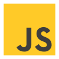

# Leonid Korshunov

_Front-end developer - CV._

---

## Contacts:

**Location:** Samara, Russia;

**Phone:** +7(999)170-24-68

**Links**: [Telegram](https://t.me/leonidkorshunov), [GitHub](https://github.com/UltimatePowerCoder);

---

## About Me:
👋 My name is Leonid, and I'm a 32-year-old front-end developer based in Samara.

🖥 I have a passion for front-end development and enjoy creating engaging and user-friendly web interfaces.

📖 I am continuously learning and staying up-to-date with the latest web technologies and trends to enhance my skills and provide cutting-edge solutions.

---

## Skills:
- Semantic, adaptive cross-browser layout 🖥️ -> 💻 -> 📱
- Page layout according to Figma and Photoshop designs 🎫
- Working with version control system Git 🔄 
- Writing functionality using JavaScript ⌨

---

## Stack:
        

---

## Code Examples:

An instance of the code editing styles on the page:

```js
const navIcon = document.querySelector('.nav-icon');
const nav = document.querySelector('.header__top-row');

navBtn.onclick = function () {
    navIcon.classList.toggle('nav-icon--active');
    nav.classList.toggle('header__top-row--mobile');
    document.body.classList.toggle('no-scroll');
}   
```

---
## Education:
- Primary school:
    - Dimitrovgrad City Gymnasium, 2001.
- Middle school:
    - Dimitrovgrad Multidisciplinary University Lyceum, 2006. 
- High school: 
    - Dimitrovgrad Multidisciplinary University Lyceum, 2008.
- University:
    - Samara State Medical University: 2013, Pharmaceutical faculty.
- Internship:
    - Samara State Medical University: 2014, Department of Management and Economics of Pharmacy.
- Courses:
    - Tomsk State University 2023, Web Programmer.

---
## Languages:
🇷🇺 Russian - native speaker.

🇬🇧 English - А2 Elementary.
